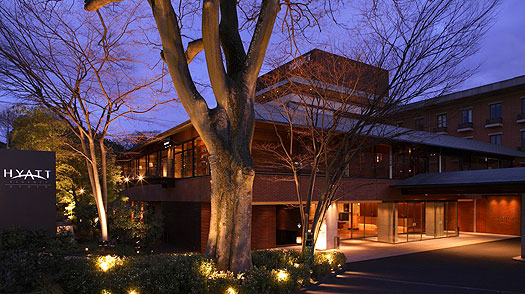
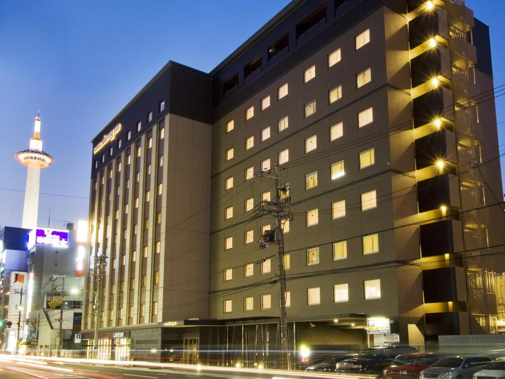
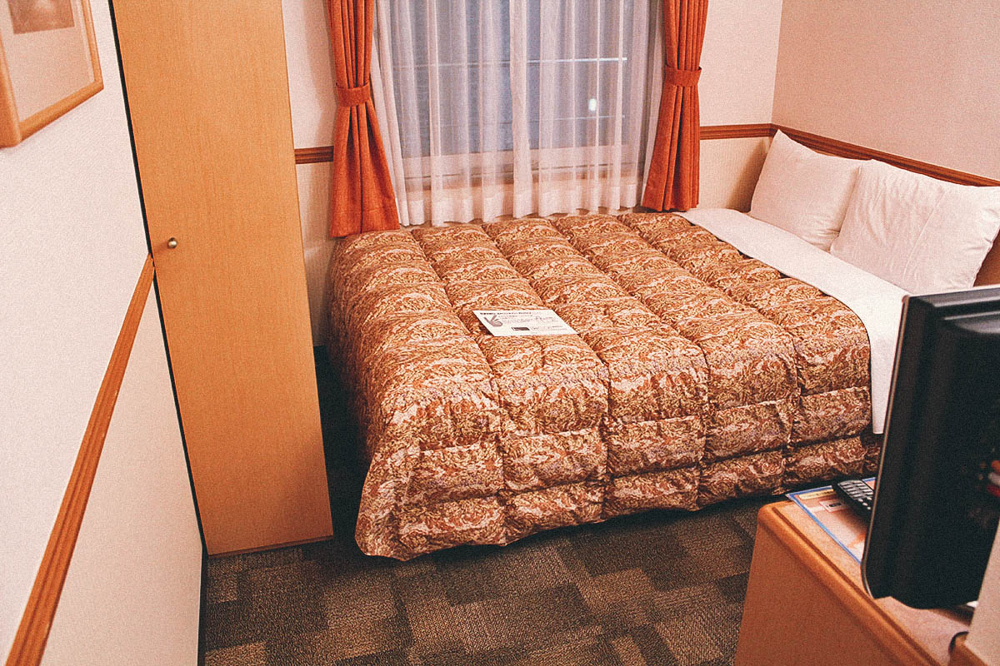
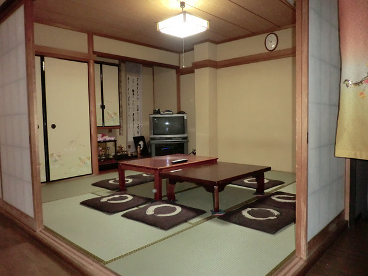
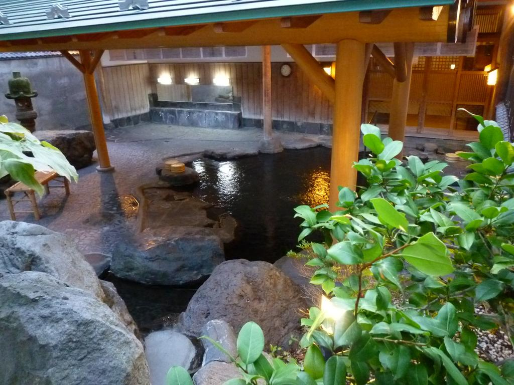
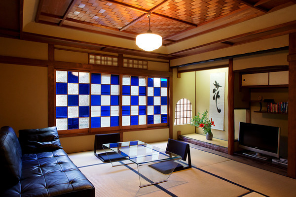

# Format
### [source](http://link.notasite)  
- Data for source
---
# Research Data
## Location
- Kyoto, Japan  
## Facts - population, time change, climate, language, how to say (basic phrases words in the native language), travel restrictions, government, etc.  (If doing one city be specific for that city)  
### [Basic Google Search](http://google.com)
- 127 million people -- Japan  
- 1.475 million people -- Kyoto City  
- Time Zone: UTC+09:00  
- Language: Japanese
### [Japan Climate](http://www.statravel.com/japan-climate.htm)  
 **Winter**  
- _December to February_, is quite dry and sunny along the Pacific coast and the temperatures rarely drop below 0°C. The temperatures drop as you move north, with the Central and Northern regions experiencing snowfall. Southern Japan is relatively temperate and experiences a mild winter.  

**Spring**  
- _March to May_.  Temperatures are warm but not too hot, plus there isn’t too much rain.  The famous cherry blossoms are out during this time and there are plenty of festivals to enjoy.  

 **Summer**
- _June to August_. Starts in June and the country experiences a three to four-week rainy season during which the farmers plant their rice.  It is hot and humid during this time and temperatures are often in the high 30’s.  

 **Fall**  
- _September to November_ and is characterised by light breezes and cooler temperatures of around 8-10oC. It’s during autumn that many exhibitions, music concerts and sports tournaments are held in Japan.  
### [Japanese Phrases](https://www.omniglot.com/language/phrases/japanese.php)
| English | 日本語 (Japanese) |
| ------- | ---------------- |
| Welcome | ようこそ (yōkoso) |
| Hello (General greeting) | 今日は (konnichiwa) |
|| おっす (ossu) - _used between close male friends_ |
|| もしもし (moshi moshi) |
| How are you? | お元気ですか？ (o genki desu ka) |
| What's your name? | お名前はなんですか? (o-namae wa nan desu ka) |
| My name is ... | ... だ (... da) (inf) |
|| ...です (... desu) (frm) |
| Pleased to meet you | 初めまして (hajimemashite) |
|| 初めまして。どうぞ宜しく (hajimemashite. dōzo yoroshiku) _reply_ |
|| お会いできて嬉しいです (oaidekite ureshii desu) |
| Good morning (Morning greeting) | お早うございます / おはようございます (ohayō gozaimasu) |
|| お早う / おはよう (ohayō) |
| Good afternoon (Afternoon greeting) | こんにちは [今日は] (konnichiwa) |
| Good evening (Evening greeting) | 	今晩は / こんばんは (konbanwa) |
| Good night | おやすみなさい (oyasumi nasai) |
|| おやすみ (oyasumi) |
| Goodbye (Parting phrases) | さようなら (sayōnara) |
|| いって来ます (ittekimasu) - 'I'll be back' - _you are leaving_ |
|| いってらっしゃい (itterasshai) - 'come back soon' - _you are staying_ |
|| じゃあまたね (jā mata ne) - see you later |
| Bon appetit / Have a nice meal | どうぞめしあがれ (douzo meshiagare) = 'enjoy your meal' - said by the cook/chef |
|| いただきます (itadakimasu) - said before a meal by those eating it |
|| ご馳走さまでした (gochisōsama deshita) - said after a meal by those who have eaten it |
| I don't know | わからない (wakaranai) - inf |
|| わかりません (wakarimasen) - frm |
| I understand | わかります (wakarimasu) |
|| わかる (wakaru) inf |
| I don't understand | 	わかりません (wakarimasen) - frm |
|| わからない (wakaranai) - inf |
| Please speak more slowly | 	ゆっくり話してください (yukkuri hanashite kudasai) |
|| ゆっくり言ってください (yukkuri itte kudasai) |
| Please say that again | もう一度、言ってください (mō ichido, itte kudasai) |
|| もうひとつ言ってください (Mō hitotsu itte kudasai) |
| Do you speak English? | 	英語はできますか (Eigo wa dekimasu ka?) |
| Do you speak Japanese? | 日本語を話しますか (Nihongo o hanashimasu ka?) |
|| 日本語は話せますか (Nihongo wa hanasemasu ka?) |
|| 日本語はできますか (Nihongo wa dekimasu ka?) |
| Yes, a little (reply to 'Do you speak ...?') | はい、話します (Hai, hanashimasu) |
|| はい、話せます (Hai, hanasemasu) |
|| はい、出来ます (Hai, dekimasu) |
| How do you say ... in Japanese? | ... は日本語でなんと言いますか。(... wa nihongo de nanto īmasu ka?) |
| Excuse me | すみません! (sumimasen) |
| Sorry | ごめんなさい! (gomen nasai) |
| Please | ください (kudasai) |
| Thank you	| どうも (dōmo) |
|| ありがとう (arigatō) |
|| ありがとうございます (arigatō gozaimasu) |
|| どうもありがとう (dōmo arigatō) |
|| どうもありがとうございます (dōmo arigatō gozaimasu) |
| Reply to thank you | どういたしまして (dō itashimashite) |
| Help! | 助けて! (tasukete!) |
| Does anyone speak English? | 	英語の話せる人はいませんか (Eigo no hanaseru hito wa imasen ka) |
|| 誰か、英語が話せますか (dare ka, eigo ga hanasemasu ka?) |
| Sorry, I didn't understand that | 	すみません。分かりませんでした (sumimasen. wakarimasen deshita) |
| How do you pronounce that? | 	これはどんな風に発音しますか (kore wa donna fū ni hatsuon shimasu ka) |
| Do you have an English menu? | 	英語のメ二ューはありますか (eigo no menyu wa arimasu ka?) |
| My hovercraft is full of eels | 私のホバークラフトは鰻でいっぱいです (Watashi no hobākurafuto wa unagi de ippai desu.) |
## The best time of year to visit and why
### [Inside Kyoto](https://www.insidekyoto.com/)
- The best times to visit Kyoto are October/November (fall) and March/April/May (spring).
- You can visit Kyoto at any time of year because the weather is temperate.
- Summer (June/July/August) in Kyoto is hot and humid.
- Winter (December/January/Febuary) in Kyoto is cold.
- The rainy season goes from mid-June to late July, but it does NOT rain every day and you can travel.

**October / November Events**
- 22 October: Jidai Matsuri (Festival of the Ages): A parade of people dressed in period costumes marches from the Kyoto Gosho (Kyoto Imperial Palace) to Heian-jingu Shrine.
- 22 October: Kurama-no-Himatsuri (Kurama Fire Festival): In the village of Kurama, a short train ride north of Kyoto, young men dressed in loincloths carry huge flaming torches through the streets. The festival starts at dusk and climaxes around 10:00pm.
- Autumn Colors – Fall Foliage Season: The stunning autumn colors in Kyoto continue throughout the month. See our Kyoto Autumn Colors guide for the more info  

**March / April / May**
- Mid-March: Plum blossom viewing: Top spots to view the plums include Kitano-Tenmangu Shrine and the Kyoto Gosho (Imperial Palace Park).
- Cherry Blossom season begins from mid-March onwards.
- Early April: Hanami (cherry blossom viewing): Top spots to see the cherries include Maruyama-koen Park, the north end of the Kyoto Gosho (Imperial Palace Park), the banks of the Kamo-gawa River, Kyoto Botanical Gardens (Kyoto Shokubutsu-en), and Gion’s Shimbashi district in the evening. See our comprehensive guide to cherry blossom season in Kyoto.
- First week of May: Golden Week holiday: Most Japanese workers are on holiday. Many sightseeing spots are crowded and hotels are expensive at this time.
- 3 May: Yabusame (horseback archery) at Shimogamo-jinja Shrine: From 1pm to 3:30pm, a horseback archery competition is held in the tree-lined arcade south of the shrine’s main hall. Don’t miss it!
- 15 May: Aoi Matsuri: One of Kyoto’s biggest festivals, this festival involves a procession from the Kyoto Gosho (Kyoto Imperial Palace) to Shimogamo-jinja Shrine via Kamigamo-jinja Shrine. The procession leaves the palace at 10:00am, arrives at Shimogamo-jinja at 2pm and at Kamigamo-jinja at 3:30pm.
## Local inns and hotels - minimum of four with information, pricing, and image(s)
### [Inside Kyoto](https://www.insidekyoto.com/)
**Best Luxury Hotel In Kyoto**  
Hyatt Regency Kyoto: The Hyatt brings it all together: beautiful rooms, attentive English-speaking staff, great onsite restaurants, good facilities and a fine location in the Southern Higashiyama sightseeing district.  
_Prices from $500 upwards_  

**Best Mid-Range Hotel In Kyoto**  
Dormy Inn Premium Kyoto Ekimae-Kyoto: Located just across the street from Kyoto Station, the Dormy Inn is a mid-range hotel that just tries harder. Topped off with a large “hot spring bath,” this is a great place to stay in Kyoto.  
_Prices from $200 upwards_  

**Best Budget Hotel In Kyoto**  
Toyoko Inn Kyoto Gojo-Karasuma: Savvy budget travelers know that the Toyoko Inn chain provides the comforts of a hotel at guesthouse prices, and the Kyoto Gojo-Karasuma branch is no exception.  
_Prices from $55 upwards_  

**Best Guesthouse In Kyoto**  
Tour Club: The Tour Club was one of the first foreigner-friendly guesthouses in Kyoto and it remains the best, due to careful management and attentive staff.  
_Prices from $22 upwards_  

**Best Ryokan In Kyoto**  
Tawaraya: Those who have stayed here know that it’s worth a trip to Japan just to sample the delights of this superb ryokan. It’s one of the finest accommodations in the world.  
_Prices from $430 upwards_  

**Best Vacation Rental In Kyoto**  
Gion House: The two units in the Gion House are stylish retreats right on the edge of all the action in Gion. They represent the best of Japanese and Western design.  
_Prices from $290 upwards_  

## The best way to get around the city/ country to sight see (transportation options for tourists)
### [Inside Kyoto](https://www.insidekyoto.com/)
1. Trains
2. Subways
3. Busses
4. Taxis
5. Cycling
6. Walking
---
**Things of Note**  
- Kyoto is a compact city with a well-developed transport network. It’s very easy to get around.
- The subways and trains are the most convenient way to get around the city.
- Buses are less convenient, but cover almost the whole city.
- Taxis are plentiful and reasonably cheap. They’re sometimes cheaper than buses for groups of three or four on short trips.
- Bicycles are a great way to get around Kyoto. The city is mostly flat and the drivers are sane. If you enjoy cycling, I strongly recommend renting a bicycle to explore the city.
- Kyoto is a great city to explore on foot. Downtown area, Arashiyama and Higashiyama are all great for walking.
- There are several special tickets that will save you tons of money if you plan on riding the buses, subways and trains a lot.
## At least top four places of interest to visit– with detailed description and image(s)IMPORTANT NOTE:  These are specific places of interest to visit not a city! Historical landmarks, museums, ruins, castles, etc.  Information and images are for this specific place to visit.  Think what a tourist would not want to miss seeing when they visit your major city or country.
-
## Historical mini lesson – Four paragraphs or bulleted list with solid information and  images
-
## Cultural info and differences(min of 5) What would be rude? Unacceptable? Expected? Gender?
-
## Information on the type and exchange of local currency. Do they deal with credit cards?
-
## Information about the local cuisine with descriptions of dishes and images (min. 4 dishes) Note: Not restaurants
-
## A frequently asked questions page with important information travelers would want.  Minimum of five questions.  Will be a separate page.
-
## A quality map of the destination – image.  Be sure it is not blurry!
-
